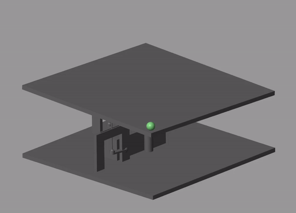
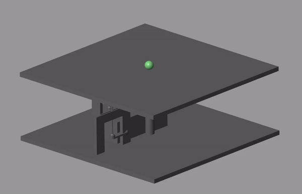
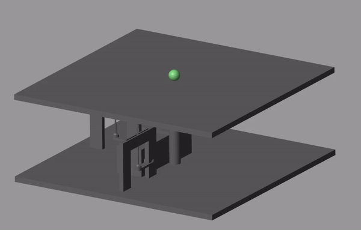
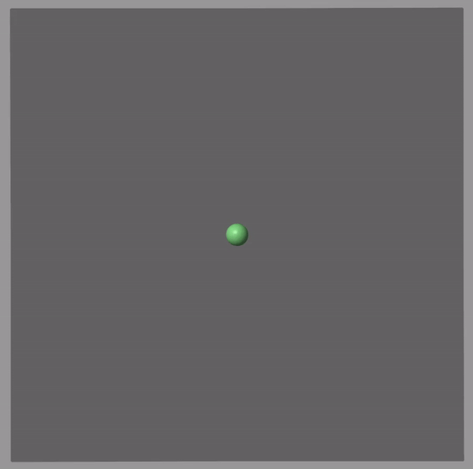

# simscapeBallBalancingTable
This repo contains a Simscape ball balancing table model. Linear state feedback is used to control the ball's position & velocity on the surface it rests on. The controller can track both stationary desired set points and time-varying trajectories.

## Instructions
1. Set current MATLAB path to directory containing repo files
2. Run both scripts titled ballBalancingTable_DataFile.m & SelfBalancingBallInitializationScript.m
3. Open ballBalancingTableModel.slx and run the simulation.
    - A circular reference trajectory & stationary reference point are both included in model. Changing between the two can be done by double clicking the switch. Both signals can be modified. The stationary reference point can be set by changing the values on the constant block. The time-varying trajectory can be changed to any signal you wish provided that you provide the derivative information as well. Note that have reference trajectories with high frequencies and/or amplitudes may results in unstable behaviour.

## Defining System
The system has 4 states. The states are defined as follows (Note that +Y is the upward direction in this model):
1. x position
2. x velocity
3. z position
4. z velocity

## Stationary reference point example

|                            Reference point at corner                           |                            Reference point at center                            |
|:------------------------------------------------------------------------------:|:-------------------------------------------------------------------------------:|
|| |

## Time-Varying reference trajectory

|                            Isometric view                           |                            Top view                                             |
|:------------------------------------------------------------------------------:|:-------------------------------------------------------------------------------:|
|| |
